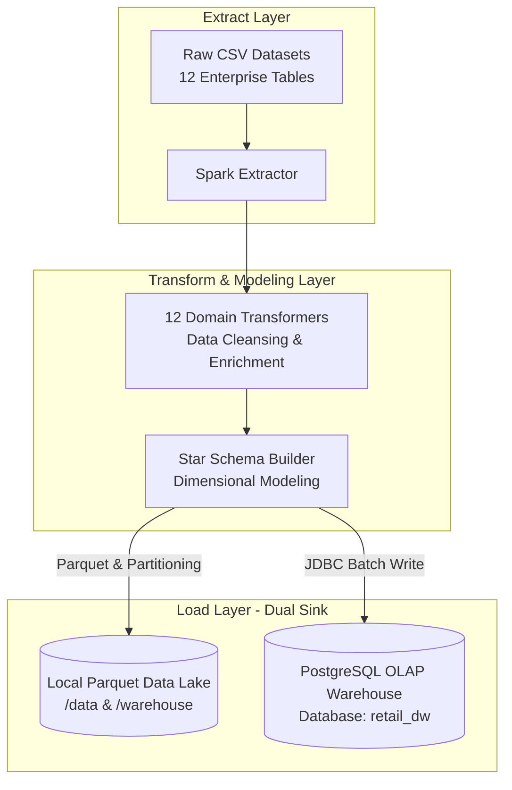

# 🛒 Retail ETL Data Warehouse Pipeline & Dimensional Modeling

An enterprise-grade **End-to-End Retail Data Warehouse Pipeline** powered by **Apache Spark (PySpark)** and **PostgreSQL**. This project extracts raw retail enterprise datasets, executes distributed transformations, models the operational data into an analytical **Star Schema (OLAP)**, and loads the refined datasets into both local **Parquet Data Lake storage** and a **PostgreSQL Data Warehouse**.

---

## 🏛️ Architecture Overview



### Key Capabilities & Pipeline Workflow

1. **Distributed Extraction (`src/extract/`):** Reads raw operational CSV datasets (Customers, Orders, Order Items, Payments, Products, Inventory, Shipments, Returns, Stores, Suppliers, Employees, Promotions) into scalable PySpark DataFrames.
2. **Domain Transformation & Enrichment (`src/transform/`):** Cleanses, deduplicates, standardizes data types, handles null values, and enforces enterprise business logic across 12 specialized ETL transformer classes.
3. **Star Schema Dimensional Modeling (`src/warehouse/`):** Converts operational entity records into an optimized Data Warehouse Star Schema consisting of **7 Dimension Tables** and **6 Fact Tables**.
4. **Dual-Sink Load Engine (`src/load/`):**
   - **Data Lake (Parquet):** Writes highly compressed, schema-enforced `.parquet` datasets to local storage, leveraging dynamic partitioning (e.g., partitioning `fact_orders` by `order_year` and `order_month`).
   - **Data Warehouse (PostgreSQL):** Connects via optimized JDBC batch writes to populate analytical tables in the PostgreSQL `retail_dw` database.
5. **Windows & Environment Resilience (`src/utils/`):** Automatically locates and injects Windows Hadoop utilities (`winutils.exe` and `hadoop.dll`) directly from the local workspace (`/hadoop/bin`), enabling frictionless local development and testing on Windows machines without external global installations.

---

# 🛠 Tech Stack

| Category | Technology |
|-----------|------------|
| Language | Python 3.13 |
| Framework | Apache Spark (PySpark) |
| Database | PostgreSQL 18 |
| Storage | Parquet |
| Data Modeling | Star Schema |
| ETL | Apache Spark |
| JDBC | PostgreSQL JDBC 42.7.12 |
| Logging | Python Logging |
| Version Control | Git & GitHub |


## 📊 Star Schema Data Model

The ETL pipeline transforms source data into a clear dimensional modeling structure engineered for BI analytical reporting and high-performance SQL querying.

### 🔷 Dimension Tables
* **`dim_date`**: Comprehensive date and time-series aggregation attributes for calendar slicing.
* **`dim_customer`**: Conformed customer profiles, segmentation, and geographic demographics.
* **`dim_product`**: Product catalog hierarchy, categorical metadata, pricing models, and SKU identifiers.
* **`dim_store`**: Physical brick-and-mortar and digital storefront properties, regions, and manager hierarchies.
* **`dim_supplier`**: Supplier business profiles, contact records, logistics endpoints, and reliability ratings.
* **`dim_employee`**: Staff profiles, departmental hierarchies, roles, and employment metrics.
* **`dim_promotion`**: Marketing campaign parameters, discount models, and active eligibility windows.

### 🔶 Fact Tables
* **`fact_orders`**: Header-level customer order transactions, timestamps, channel metrics, and fulfillment statuses. *(Dynamic partitioning by Year & Month in Parquet storage)*
* **`fact_order_items`**: Detailed line-item transactional quantities, unit prices, discount allocations, and extended costs.
* **`fact_payments`**: Financial settlement records, multi-modal payment classifications, and transaction clearance states.
* **`fact_shipments`**: Logistics delivery events, carrier performance tracking, shipping fees, and transit duration analytics.
* **`fact_returns`**: Returned merchandise authorizations, refund values, product defect classifications, and resolution states.
* **`fact_inventory`**: Periodic snapshot facts capturing stock levels, inventory valuation, reorder thresholds, and warehouse shrinkage.

---

## 🚀 Spark Tuning & Performance Optimizations

The pipeline is pre-configured with enterprise PySpark execution tuning (`SparkSessionBuilder` in `src/utils/spark_session.py`):
- **Adaptive Query Execution (AQE):** Dynamically re-optimizes query plans at runtime based on execution metrics (`spark.sql.adaptive.enabled = true`).
- **Dynamic Partition Coalescing:** Automatically collapses and consolidates post-shuffle partitions to prevent small-file overhead (`spark.sql.adaptive.coalescePartitions.enabled = true`).
- **Apache Arrow Serialization:** Enables Apache Arrow to accelerate data serialization between JVM and Python processes (`spark.sql.execution.arrow.pyspark.enabled = true`).
- **Optimized Shuffle & Broadcast Thresholds:** Tuned for local multi-core parallel processing (`master("local[*]")`), efficient shuffle partitioning (`8`), and calibrated broadcast join thresholds (10 MB).

---

## 📁 Repository Structure

```text
spark-etl-project/
├── data/                       # Local storage directories
│   ├── raw/                    # Source operational CSV datasets
│   ├── staging/                # Temporary intermediate datasets
│   └── processed/              # Cleaned Parquet domain tables
├── drivers/                    # JDBC driver libraries (postgresql-42.7.12.jar)
├── hadoop/                     # Bundled Windows Hadoop binaries
│   └── bin/                    # winutils.exe & hadoop.dll
├── logs/                       # Rotating runtime execution logs
├── output/                     # Exported analytical reports & dumps
├── src/                        # Main application Python modules
│   ├── extract/
│   │   └── extract.py          # CSV ingestion and schema definition engine
│   ├── load/
│   │   ├── load.py             # Parquet Data Lake file loading & partitioning
│   │   └── postgres_loader.py  # PostgreSQL JDBC data warehouse writer
│   ├── transform/              # Domain data transformers (12 classes)
│   │   ├── customer_transform.py
│   │   ├── order_transform.py
│   │   ├── product_transform.py
│   │   └── ...
│   ├── utils/
│   │   ├── config.py           # Global folder paths & pipeline configuration
│   │   ├── logger.py           # Structured rotating logging handler
│   │   ├── postgres_config.py  # PostgreSQL credentials & JDBC URI setup
│   │   └── spark_session.py    # Spark session builder & winutils configuration
│   ├── warehouse/
│   │   └── star_schema.py      # Star Schema dimension & fact construction logic
│   └── main.py                 # Pipeline orchestration entrypoint script
├── warehouse/                  # Parquet OLAP data sink
│   ├── dimensions/             # Exported dimension tables (dim_*)
│   └── facts/                  # Exported fact tables (fact_*)
├── .gitignore                  # Git ignore directives for runtime & data artifacts
├── requirements.txt            # Python library dependencies
└── README.md                   # Project documentation & usage guide
```

---

## 🛠️ Setup & Installation Guide

### Prerequisites
1. **Python 3.10+**: Ensure Python is installed and accessible in your environment PATH.
2. **Java JDK (8 or 11+)**: Required for running the Apache Spark JVM engine (`JAVA_HOME` properly set).
3. **PostgreSQL (v12+)**: Running locally or remotely with access credentials.

### 1. Clone Repository & Install Dependencies
Open your command prompt or terminal in the project root directory and install the required dependencies:
```bash
pip install -r requirements.txt
```

### 2. Database Configuration
Ensure your target PostgreSQL data warehouse exists:
```sql
CREATE DATABASE retail_dw;
```

Update your database credentials inside `src/utils/postgres_config.py` if your port, username, or password differ from defaults:
```python
POSTGRES_CONFIG = {
    "host": "localhost",
    "port": "5434",          # Modify port if running on default 5432
    "database": "retail_dw",
    "user": "postgres",
    "password": "your_password_here"
}
```
*Note: The required PostgreSQL JDBC driver (`postgresql-42.7.12.jar`) is bundled directly inside `/drivers`. The pipeline automatically mounts this driver to the Spark classpath.*

### 3. Generate Source Datasets
To keep this Git repository lightweight, raw transactional dataset files (`*.csv`) are excluded from version control via `.gitignore`. 

To generate the required enterprise operational datasets (`customers.csv`, `orders.csv`, `products.csv`, `inventory.csv`, etc.), clone and execute the dedicated **Retail Data Generator** repository:
```bash
git clone https://github.com/tharun-reddy-8118/retail-data-generator.git
```
Follow the setup instructions in that repository, and place the generated `.csv` dataset files directly into the `data/raw/` directory of this pipeline project.

---

## ▶️ Running the ETL Pipeline

To trigger the end-to-end extraction, transformation, Star Schema modeling, and database loading, execute the root module entry point from your command line:

```bash
python -m src.main
```

### Execution Steps:
1. **Bootstrap:** Validates Windows Hadoop binaries and starts an optimized SparkSession with JDBC support.
2. **Ingest:** Reads all 12 operational CSV datasets from `data/raw/`.
3. **Transform:** Cleanses, deduplicates, enriches, and validates enterprise business logic.
4. **Model:** Synthesizes `dim_*` and `fact_*` entities according to Star Schema architecture.
5. **Data Lake Write:** Saves compressed Parquet datasets into `data/processed/`, `warehouse/dimensions/`, and `warehouse/facts/` with optimized partition hashing.
6. **Data Warehouse Load:** Establishes a batch JDBC connection and registers the relational OLAP tables directly into PostgreSQL (`retail_dw`).

---

## 📈 Logging & Diagnostics
The pipeline incorporates a logging layer designed for real-time monitoring and historical troubleshooting:
- **Console Stream:** Clean INFO/WARN operational progress milestones displayed in standard stdout.
- **Log Audit File:** Detailed runtime execution traces, stack traces, and timing metrics are continuously captured in `logs/etl.log`.

---

## 🤝 Version Control (Git) Notice
This repository includes a curated `.gitignore` profile optimized for Data Engineering workloads:
- Large binary files, generated local Data Lake folders (`data/processed/*`, `warehouse/*`, `output/*`), Python compiled bytecodes (`__pycache__/`), and local crash logs (`*.log`) are ignored by default.
- This ensures Git tracking remains lightweight, modular, and focused purely on application logic and configurations.
